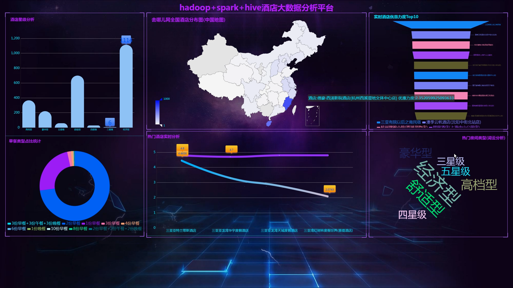
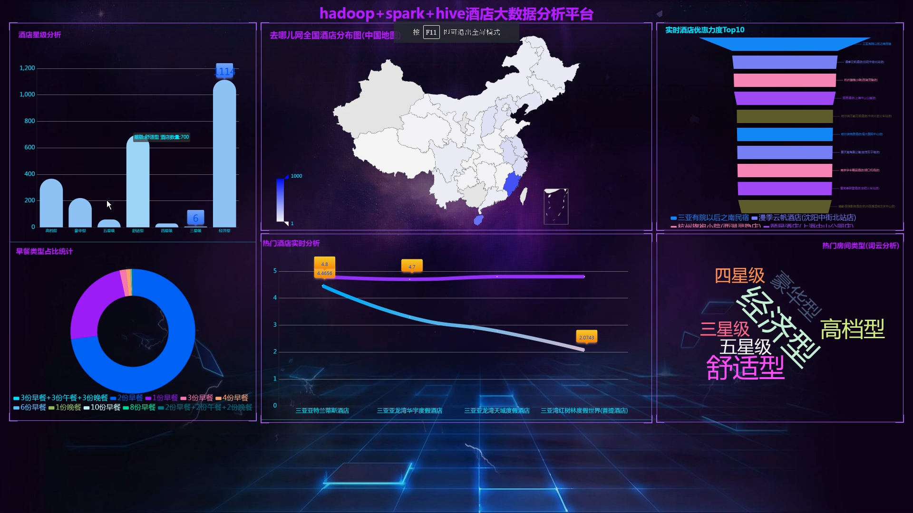
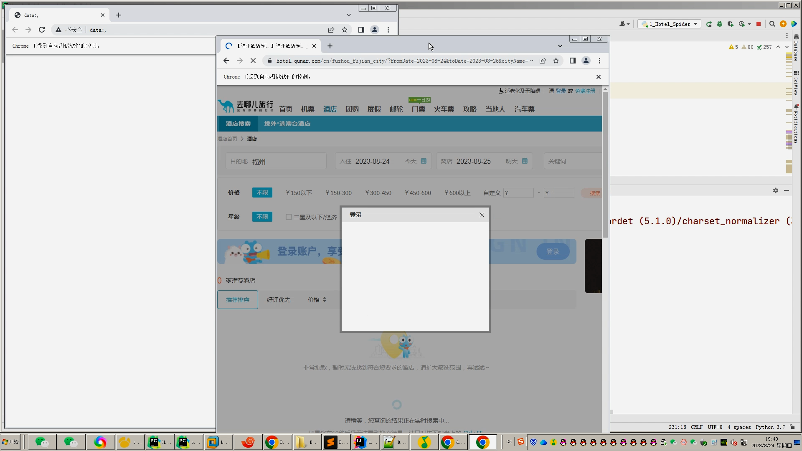
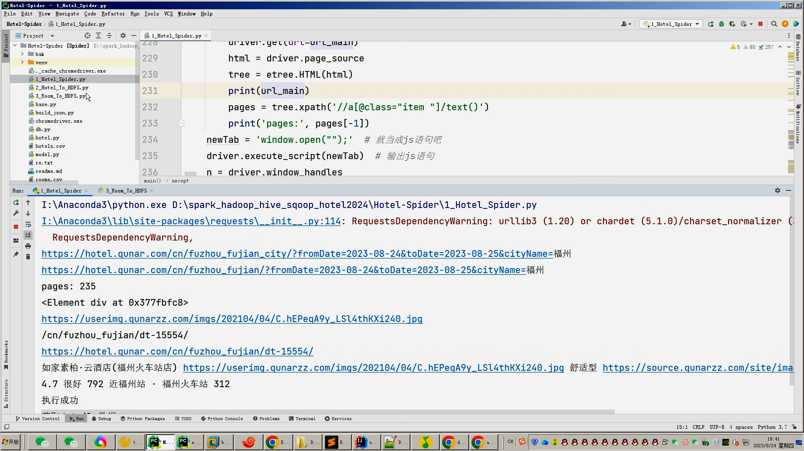
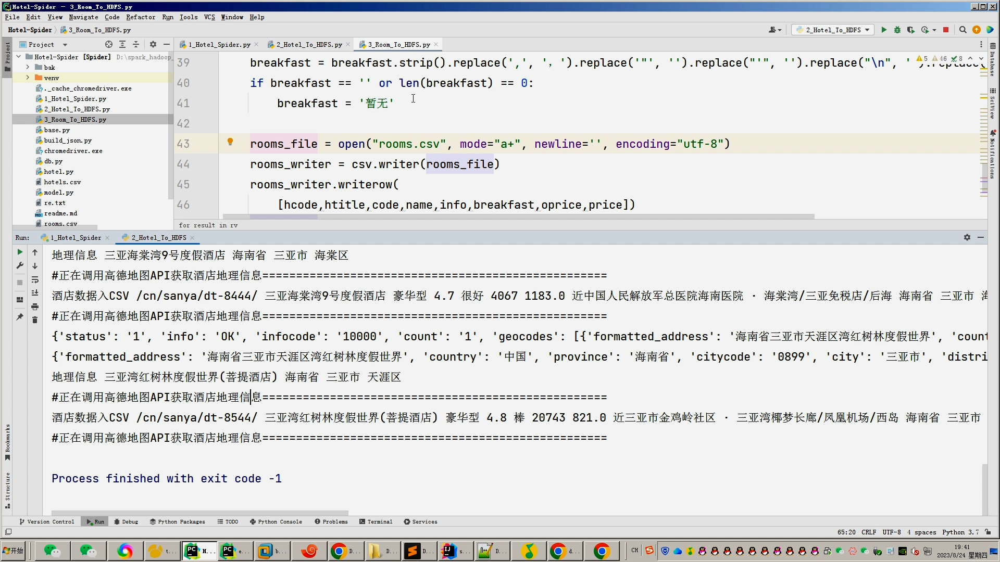
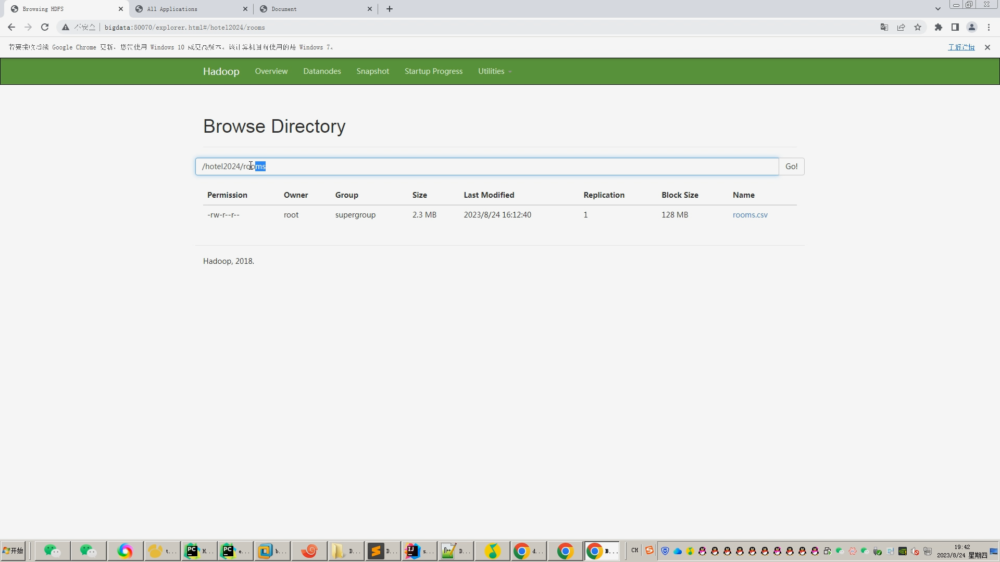
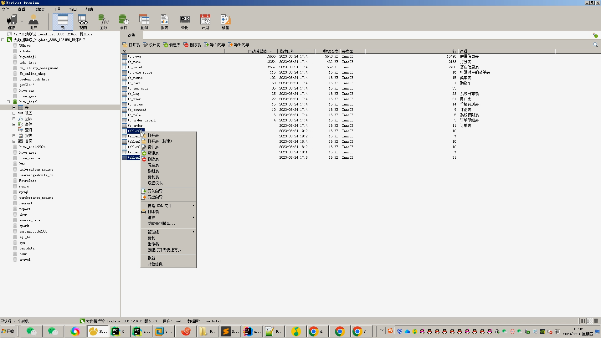
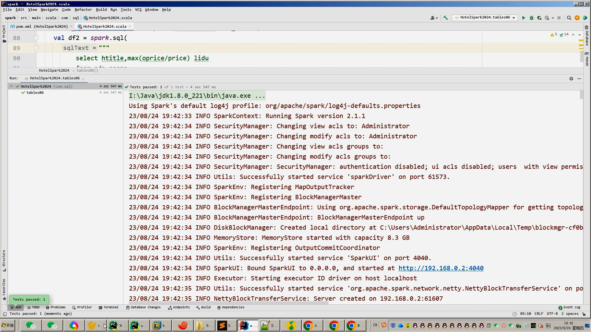
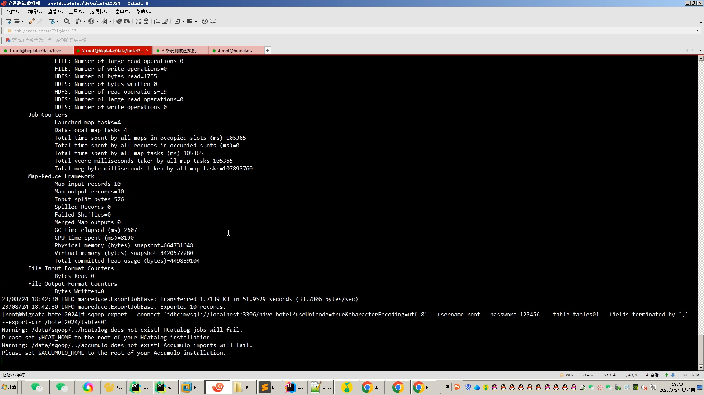

## 计算机毕业设计吊打导师hadoop+spark+hive知识图谱酒店推荐系统 酒店数据分析可视化大屏 酒店爬虫 高德地图API 酒店预测系统 大数据毕业设计 大数据毕业设计 知识图谱 大数据毕业设计 预测系统 实时计算 离线计算 数据仓库 人工智能 神经网络

## 要求
### 源码有偿！一套(论文 PPT 源码+sql脚本+教程)

### 
### 加好友前帮忙start一下，并备注github有偿hive酒店推荐
### 我的QQ号是2827724252或者798059319或者 1679232425或者微信:bysj2023nb

# 

### 加qq好友说明（被部分 网友整得心力交瘁）：
    1.加好友务必按照格式备注
    2.避免浪费各自的时间！
    3.当“客服”不容易，repo 主是体面人，不爆粗，性格好，文明人。

### 本系统B站视频演示链接：

https://www.bilibili.com/video/BV17G411Z7zz/?spm_id_from=333.999.0.0

### 运行截图

## 流程：

1.Python爬取去哪儿网全站旅游数据约10万+，存入mysql;

2.使用pandas+numpy/hadoop+mapreduce对mysql中旅游数据进行数据清洗，使用高德API计算地理信息，最终转为.csv文件上传hdfs;

3.hive建库建表导入.csv文件作为数据集；

4.一半指标使用离线hive_sql分析完成，一半指标使用实时Spark之Scala完成；

5.分析结果使用sqoop导入mysql;

6.使用Flask+echarts构建可视化大屏；

## 开发技术：
selenium(Python爬虫)、spark、hadoop、scala、hive、sqoop、Flask、echarts、mysql等；
## 创新点：
大屏可视化、Python爬虫、高德地图、Spark实时计算、Hadoop+Hive离线计算全部实现

## 题目特色：
比较冷门，就算有人给你撞题了我的系统你也可以分分钟吊打答辩现场！

### 可选装：
            如果你的老师还是喜欢狂喷你，那么你可以选装更屌的功能。

            1.推荐系统(4种深度学习推荐算法 协同过滤基于用户 基于物品 SVD神经网络 MLP)。附带AI、支付、短信、lstm情感分析。

            2.预测系统(KNN CNN RNN卷积神经预测 K-means 线性回归)。

            3.知识图谱neo4j可视化关系网络图。

            4.后台管理系统。

### 选装与之匹配的推荐系统/知识图谱/后台/预测系统界面如下链接：
## 选装(如果觉得功能太简单或者工作量不够)-->推荐系统、预测系统、知识图谱、后台管理

https://www.bilibili.com/video/BV18m4y1e7Pj/?spm_id_from=333.999.0.0

